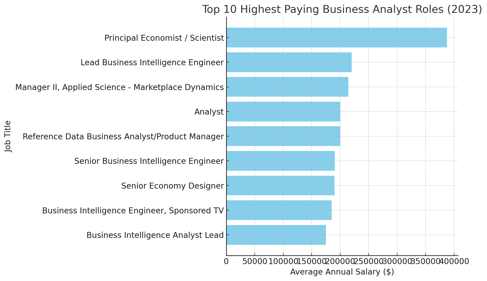
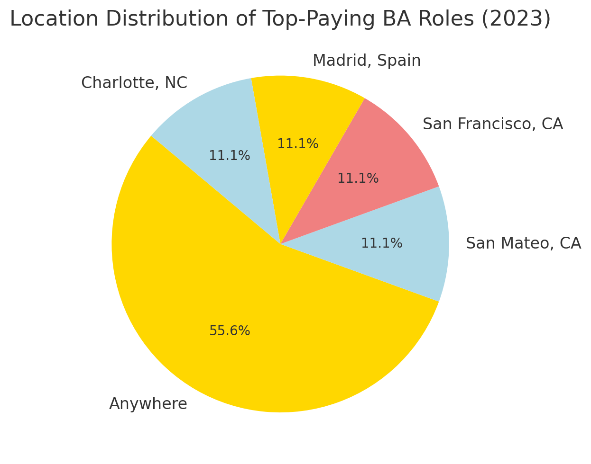
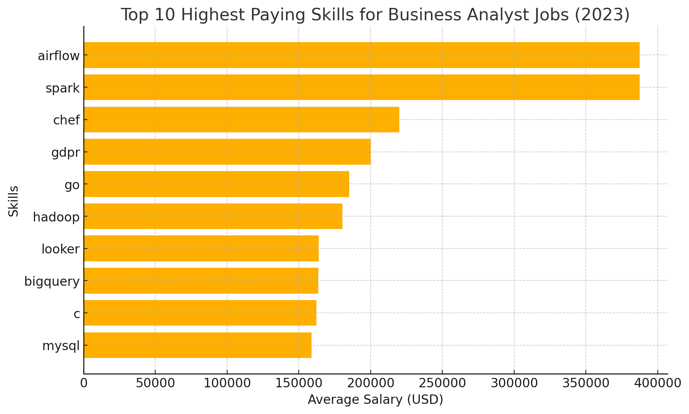
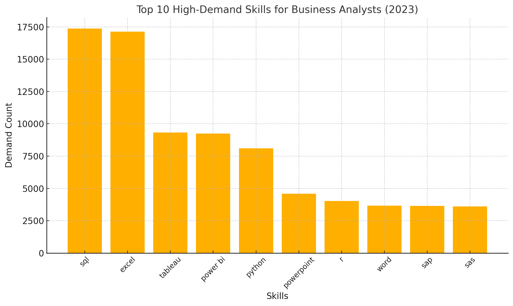
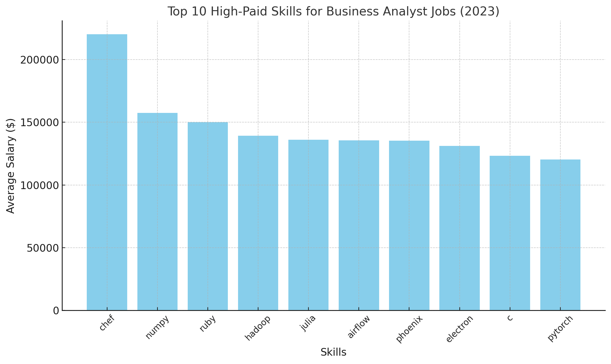

# Introduction

If you're interested in a Business Analyst role, you might be curious about which skills to focus on to land the job, right? This project explores top-paying Business Analyst positions, the most in-demand skills for the role, and where high demand intersects with high salaries in the Business Analyst field.

SQL queries here : [project_sql folder](/project_sql/)

# Background

The data used in this project is from 2023. It includes job postings across various roles in the IT industry, such as Data Analyst, Business Analyst, Data Engineer, and more.

The data was sourced from the YouTube channel [LukeBarousse](https://www.youtube.com/@LukeBarousse)

[raw data ](https://drive.google.com/drive/folders/1moeWYoUtUklJO6NJdWo9OV8zWjRn0rjN)

## The questions I wanted to know from SQL queries ware

1.  What are the top-paying Business analyst jobs?
2.  What skills are required for the top-paying business analyst jobs?
3.  What are the most in-demand skills for Business Analyst?
4.  What are the top skills based on salary?
5.  What are the most optimal skills to learn (aka it’s in high demand and a high-paying skill)?

# Tool I used

- **SQL**: Allow me to query the database .
- PostgreSQL : Database management.
- Visual Studio Code : Code Editor.
- Git & Github : Version control.

# The analysis

Each query in this project is designed to address a specific aspect of the Business Analyst job market. Below is an explanation of how I approached each question and constructed the queries.

### 1. What are the top-paying Business analyst jobs?

To identify the highest-paying Business Analyst jobs, I filtered the job postings by their average yearly salaries and sorted them in descending order.

```sql
SELECT job_id,
    job_title,
    job_location,
    job_schedule_type,
    salary_year_avg,
    job_posted_date,
    name as company_name
FROM
    job_postings_fact
LEFT JOIN
company_dim ON job_postings_fact.company_id = company_dim.company_id
WHERE
    job_title_short = 'Business Analyst'
    -- AND job_location = 'Bangkok, Thailand'
    AND salary_year_avg IS NOT NULL
ORDER BY
    salary_year_avg DESC
LIMIT
    100
```



- the highest is 387,460 $ but others in range between 150-200K



- 55.6% of Highest Paying Business Analyst Job is working

### 2. What skills are required for the top-paying business analyst jobs?

use the query result from first topic to find more about skills of these high paying job by joining other table (skills_job_dim,skills_dim)

```sql
WITH top_paying_job_Thailand AS (
    SELECT job_id,
        job_title,
        salary_year_avg,
        job_posted_date,
        name as company_name
    FROM job_postings_fact
        LEFT JOIN
        company_dim ON job_postings_fact.company_id = company_dim.company_id
    WHERE
        job_title_short = 'Business Analyst'
        AND salary_year_avg IS NOT NULL
    ORDER BY
        salary_year_avg DESC
    LIMIT 100
)
SELECT
    top_paying_job_Thailand.*,
    skills
FROM
    top_paying_job_Thailand
INNER JOIN
    skills_job_dim ON top_paying_job_Thailand.job_id = skills_job_dim.job_id
INNER JOIN
    skills_dim ON skills_dim.skill_id = skills_job_dim.skill_id
ORDER BY
    salary_year_avg DESC
```



- skills for highest paying job might not be the high demand skill ?

### 3. What are the most in-demand skills for Business Analyst?

in order to check that high pay business analyst skills is the same skill with the hight demand business analyst skill in the market.So we filter all job posting with 'Business Analyst' first then join other table then count the skills

```sql
SELECT
    skills,
    COUNT(skills_job_dim.job_id) AS demand_count
FROM
    job_postings_fact
INNER JOIN
    skills_job_dim ON job_postings_fact.job_id = skills_job_dim.job_id
INNER JOIN
    skills_dim ON skills_dim.skill_id = skills_job_dim.skill_id
WHERE
    job_title_short = 'Business Analyst'
GROUP BY
    skills
ORDER BY
    demand_count DESC
LIMIT 10
```



- High demand skills seem not the same with Highest Paying skills
- Most High demand skills are SQL and Excel then power bi and tableau

### 4. What are the top skills based on salary?

Which skills gain highest paid for Business analyst ?

```sql
SELECT
    skills,
    ROUND(AVG(salary_year_avg), 0) AS avg_salary
FROM
    job_postings_fact
INNER JOIN
    skills_job_dim ON job_postings_fact.job_id = skills_job_dim.job_id
INNER JOIN
    skills_dim ON skills_dim.skill_id = skills_job_dim.skill_id
WHERE
    job_title_short = 'Business Analyst'
    AND salary_year_avg IS NOT NULL
GROUP BY
    skills
ORDER BY
    avg_salary DESC
```



- these job is seem not high demand.

### 5. What are the most optimal skills to learn (High demand , High salary)

use result from previous 3 , 4 inner join together

```sql
WITH skills_demand AS (
    SELECT skills_dim.skills,
        skills_dim.skill_id,
        COUNT(skills_job_dim.job_id) AS demand_count
    FROM
        job_postings_fact
    INNER JOIN
        skills_job_dim ON job_postings_fact.job_id = skills_job_dim.job_id
    INNER JOIN
        skills_dim ON skills_dim.skill_id = skills_job_dim.skill_id
    WHERE
        job_title_short = 'Business Analyst'
        AND salary_year_avg IS NOT NULL
    GROUP BY
        skills_dim.skill_id
),
average_salary AS (
    SELECT skills_dim.skills,
        skills_dim.skill_id,
        ROUND(AVG(salary_year_avg), 0) AS avg_salary
    FROM
        job_postings_fact
    INNER JOIN
        skills_job_dim ON job_postings_fact.job_id = skills_job_dim.job_id
    INNER JOIN
        skills_dim ON skills_dim.skill_id = skills_job_dim.skill_id
    WHERE
        job_title_short = 'Business Analyst'
        AND salary_year_avg IS NOT NULL
    GROUP BY
        skills_dim.skill_id
)
SELECT
    skills_demand.skill_id,
    skills_demand.skills,
    demand_count,
    avg_salary
FROM
    skills_demand
INNER JOIN
    average_salary ON skills_demand.skill_id = average_salary.skill_id
ORDER BY
    demand_count DESC,
    avg_salary DESC
LIMIT 25
```

|  Skills  | Demand Count | Average Salary ($) |
| :------: | :----------: | :----------------: |
|   SQL    |     312      |       95,292       |
|  Excel   |     226      |       87,212       |
| Tableau  |     212      |       98,794       |
|  Python  |     143      |      104,277       |
| Power BI |     139      |       92,059       |

# What I learned

- This project make me more familiar with SQL queries
- This project make me more familiar with how Business Analyst should think about the data

# Conclusion

- Skills that individuals interested in a Business Analyst role should focus on include SQL, Excel, Tableau, Python, and Power BI, as these skills meet both high-demand and high-salary criteria.

- However, if you only consider skills associated with the highest salaries, you may notice they are often linked to low-demand jobs. Making decisions based solely on this criterion could lead to unexpected or undesirable outcomes.

- Good Hypothesis → Good Criteria → Good Analysis Results
